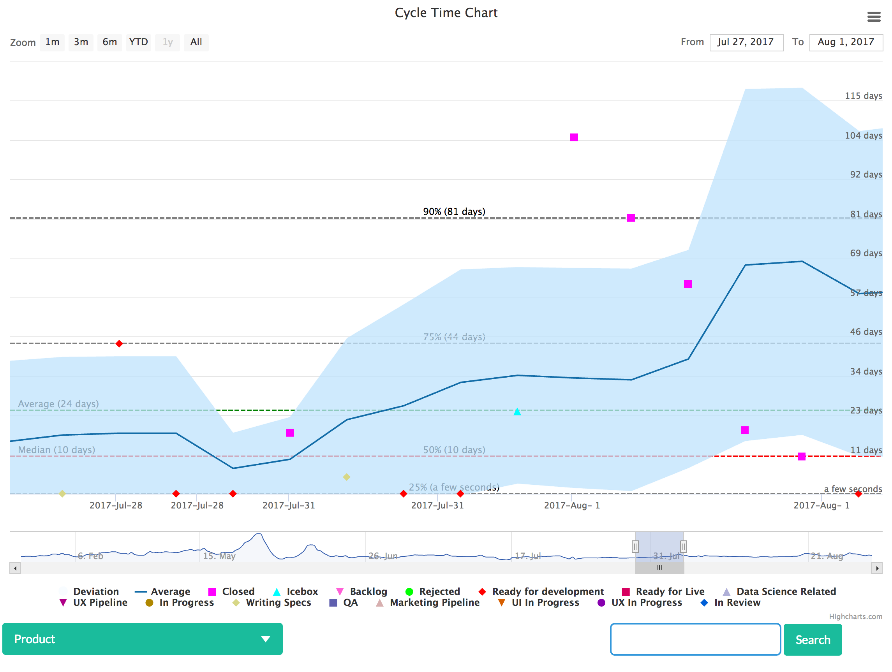
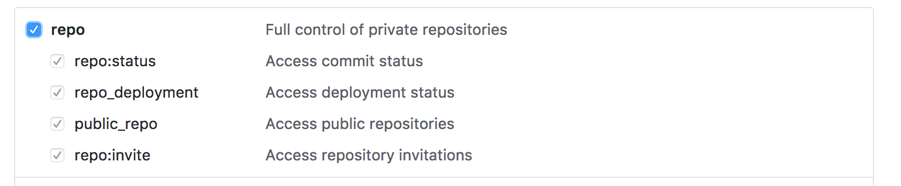

# ZenHub Cycle Time Chart

ZenHub Cycle Time Chart let's you visualize cycle times on your ZenHub board.



See the [blog post](https://medium.com/adphorus-engineering/introducing-cycle-time-for-zenhub-3101509187c8) for more detail.

## Installation

### Installation on Os X

There is an installation script which handles all the steps below. Run:

```
./install_osx.sh
```

### Manual Installation

Install [Redis](https://redis.io/) and [PostgreSQL](https://www.postgresql.org/). (This application is dependent on PostgreSQL's JSONB field.)

Create virtualenv using `python>=3.6`.

Install requirements:

```
pip install -r requirements/base.txt
```

### Development settings

Install requirements:

```
pip install -r requirements/dev.txt
```

Copy settings:

```
cp zenhub_charts/settings_dev.py-dist zenhub_charts/settings_dev.py
```

Specify settings module:

```
export DJANGO_SETTINGS_MODULE='zenhub_charts.settings_dev'
```

(Better set and unset this in your virtualenv's `bin/activate` script)

### Extra settings

`settings.DEBUG` is `False` by default. But this won't allow serving static files with development server. So you can override anything in `zenhub_charts/settings_local.py`.

## Configuration

In order to fetch issues from both `GitHub` and `ZenHub`, you need to specify your tokens.

* [Get your ZenHub token](https://dashboard.zenhub.io/#/settings)
* [Get your GitHub token](https://github.com/settings/tokens) (Select repo scope)



create a file called `credentials.py` under `zenhub_charts` directory:

```
# zenhub_charts/credentials.py

GITHUB = {
    'token': '<your token>',
    'owner': '<Organization or user name>'
}
ZENHUB = {
    'token': '<your token>'
}
```

`settings.py` will try to read this file.

## Preparing the database

Create postgresql database:

```
createdb zenhub_charts
```

Run migrations

```
./manage.py migrate
```


## Getting Issues from GitHub and ZenHub

It is currently a manual process

```
./manage.py fetch --initial
```

* **initial:** Run the command for the first time. This parameter let's us fetch previously closed issues. 
* **fix:** If `--initial` is specified, you do not need to give this parameter. It may ask you questions about pipeline name mappings. We can not track previous name changes, so you have to define them on the first run. Otherwise you can just give this parameter and add new name changes without running another `--initial` fetch.


### Periodic tasks

First of all configure your broker.

```
CELERY_BROKER_URL = 'redis://localhost:6379/0'
CELERY_RESULT_BACKEND = 'redis'
```

Then run Celery with beat (`-B`) support.


```
celery -A zenhub_charts worker -B -l info
```

A periodic task will fetch new issues every 3 hours.

## Run the server

```
./manage.py runserver
```

Visit [http://localhost:8000](http://localhost:8000)

## Admin

In order to use the admin, run:

```
./manage.py createsuperuser
```

go to [http://localhost:8000/admin](http://localhost:8000/admin)

##Docker

You can create docker image.

For web-app:
```
docker build  -f Dockerfile -t <web app image name> --rm .
```

For workers:
```
docker build  -f Celery.Dockerfile -t <workers image name> --rm .
```

Env variables that configures app in docker:

```
GITHUB_TOKEN=<your token>
GITHUB_OWNER=<Organization or user name>
ZENHUB_TOKEN=<your token>
DB_NAME=<database name for PostgreSql>
DB_USER=<user name for PostgreSql>
DB_PASSWORD=<user name for PostgreSql>
DB_HOST=<PostgreSql host>
DB_PORT=<PostgreSql port>
CELERY_BROKER_URL=<url to redis>
SECRET_KEY=<secret key for web app>
```

How to run web app:

```
docker run -it \
    -e GITHUB_TOKEN=<your token> \
    -e GITHUB_OWNER=<Organization or user name> \
    -e ZENHUB_TOKEN=<your token> \
    -e DB_NAME=<database name for PostgreSql> \
    -e DB_USER=<user name for PostgreSql> \
    -e DB_PASSWORD=<user name for PostgreSql> \
    -e DB_HOST=<PostgreSql host> \
    -e DB_PORT=<PostgreSql port> \
    -e CELERY_BROKER_URL=<url to redis> \
    -e SECRET_KEY=<secret key for web app> \
    -p 8000:8000 \
    <web app image name>
```

How to run workers:

```
docker run -it \
    -e GITHUB_TOKEN=<your token> \
    -e GITHUB_OWNER=<Organization or user name> \
    -e ZENHUB_TOKEN=<your token> \
    -e DB_NAME=<database name for PostgreSql> \
    -e DB_USER=<user name for PostgreSql> \
    -e DB_PASSWORD=<user name for PostgreSql> \
    -e DB_HOST=<PostgreSql host> \
    -e DB_PORT=<PostgreSql port> \
    -e CELERY_BROKER_URL=<url to redis> \
    -e SECRET_KEY=<secret key for web app> \
    -p 8000:8000 \
    <workers image name>
```
